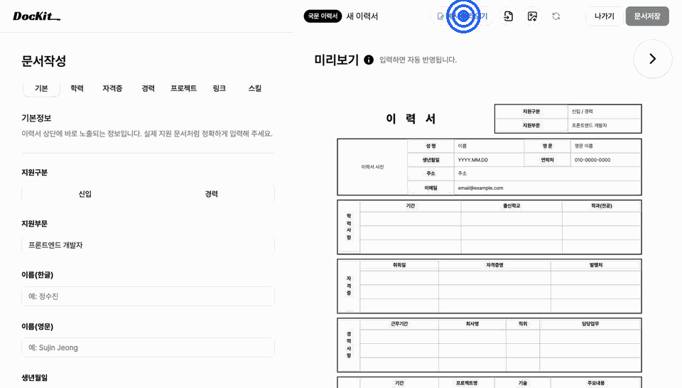
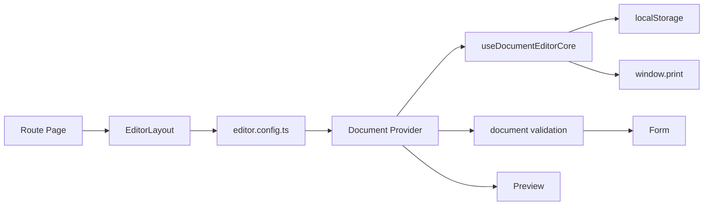

# DocKit - 국문 제출 문서 작성 도구

> 이력서, 자기소개서, 경력기술서를 입력하면서 실제 제출 양식으로 미리 보고 PDF로 저장할 수 있는 React 문서 작성 도구입니다.

[데모 보기](https://dockit.jsjweb0.workers.dev/) · [GitHub](https://github.com/jsjweb0/dockit)

DocKit 예시 불러오기와 PDF 저장 흐름



## 🚀 왜 만들었나요?

한글·Word 기반 문서 작성은 복잡한 표 레이아웃을 셀 단위로 직접 수정해야 하는 번거로움이 있습니다.

직접 문서를 여러 번 작성/제출하며 겪었던 이 문제를, 실시간 미리보기 기반 웹 도구로 해결해보고자
1인으로 기획부터 배포까지 진행했습니다.

- 기획 → 이력서 표 양식 케이스 조사 → 데이터 모델 설계 → 저장/검증 공통화 → PDF 출력 순으로 진행
- 현재 이력서/자기소개서/경력기술서 3종 지원, 프로젝트 보고서/회의록 추가 예정

**개발 기간**: 2026.04 ~ 2026.07 (1인 개발)

---

## 핵심 구현 포인트

| 문제                                                 | 구현                                                       | 결과                                                                                                     |
| ---------------------------------------------------- | ---------------------------------------------------------- | -------------------------------------------------------------------------------------------------------- |
| 국문 이력서의 복잡한 표 구조                         | colSpan/rowSpan 기반 미리보기 컴포넌트와 print CSS 분리    | 화면용 preview와 인쇄용 스타일을 분리해 PDF 저장 시 표 경계, 여백, 숨김 UI를 print CSS에서 제어          |
| 문서 타입 추가 시 저장/최근 문서/삭제 로직 반복 발생 | 공통 저장/검증 흐름을 documents 도메인으로 분리            | 이력서/자기소개서/경력기술서가 같은 저장 API를 사용하고, 문서별 차이는 config와 storage 생성 함수로 제한 |
| 제출용 PDF 출력                                      | canvas 캡처 대신 window.print + @media print 사용          | 텍스트 선택 가능한 PDF 출력과 인쇄 레이아웃 관리                                                         |
| 이력서 검증 오류 위치 탐색이 복잡함                  | `resumeValidationAdapter`에서 fieldKey, tab, input id 매핑 | 저장 전 전체 검증, 탭 오류 개수, 첫 오류 필드 포커스 이동을 하나의 흐름으로 처리                         |

---

## 설계 과정

DocKit은 국문 이력서, 자기소개서, 경력기술서처럼 문서 종류가 늘어나는 상황을 고려해 설계했습니다.  
처음에는 이력서 작성 기능에서 시작했지만, 문서가 추가되면서 저장, 검증, 미리보기, PDF 출력처럼 반복되는 흐름을 공통화할 필요가 있었습니다.



### 문서 양식 확장을 고려한 구조

공통 작성 화면은 `EditorLayout`에서 처리하고, 문서별로 달라지는 Provider, 샘플 데이터, 최근 문서 저장소, 제목 생성 함수는 `editor.config.ts`에서 설정으로 연결했습니다.

또한 저장, 내보내기, 공통 검증 흐름은 `features/documents`에 분리하고, 이력서·자기소개서·경력기술서의 타입, 기본값, 개별 검증 규칙은 각각의 feature 폴더에서 관리했습니다.

이 구조를 통해 새 문서 양식을 추가할 때 공통 레이아웃을 크게 수정하지 않고, 문서별 설정과 도메인 로직만 추가할 수 있도록 했습니다.

---

## 문제 해결

### 1. 문서 양식 확장을 고려한 에디터 구조 개선

**문제**  
초기에는 이력서 작성 기능만 있었기 때문에 이력서 기준으로 폴더 구조와 상태 관리 로직을 구성했습니다.  
하지만 자기소개서와 경력기술서 양식이 추가되면서 저장, 검증, 예시 데이터 불러오기, 최근 문서 관리, 제목 생성처럼 문서마다 반복되는 로직이 늘어났습니다.

또한 Context가 문서 상태뿐 아니라 검증, 템플릿 설정, 화면 동작까지 함께 관리하면서 책임이 커지고, 새 문서 양식을 추가할 때 기존 구조를 이해해야 하는 범위가 넓어지는 문제가 있었습니다.

**해결**  
Context에는 현재 문서 데이터와 문서 상태 변경처럼 에디터 상태에 직접 관련된 책임만 남겼습니다.  
문서별 템플릿 정보는 `documentTemplates.ts`, 검증 흐름은 문서별 validation hook과 공통 `useDocumentValidation`으로 분리했습니다.

또한 문서마다 필요한 Provider, `useEditor`, 샘플 데이터, 제목 생성 함수를 `editor.config.ts`에서 하나의 설정 형식으로 관리했습니다.  
이때 `DocumentEditorConfig<T>` 제네릭 타입을 사용해 문서별 데이터 타입과 설정이 함께 연결되도록 정리했습니다.

```ts
type DocumentEditorConfig<TDocument> = {
  Provider: ComponentType<DocumentEditorProviderProps>;
  useEditor: () => CommonDocumentEditorState<TDocument>;
  getTitle: (document: TDocument) => string;
  createSample: () => TDocument;
};
```

문서별 차이는 config에 모으고, `EditorLayout`은 공통 작성 화면만 담당하도록 역할을 분리했습니다.

**결과**

`EditorLayout`은 각 문서의 내부 데이터 구조를 직접 알지 않아도, 설정으로 전달된 Provider와 `useEditor`를 사용해 공통 작성 화면을 구성할 수 있게 되었습니다.
새 문서 양식을 추가할 때는 공통 레이아웃을 수정하기보다 문서별 config, Provider, validation hook을 연결하는 방식으로 확장할 수 있어 유지보수 범위가 줄었습니다.

### 2. 문서별 복잡도에 맞는 검증 구조 설계

**문제**

이력서는 기본 정보, 학력, 경력, 프로젝트, 링크처럼 입력 항목과 반복 섹션이 많아 필드 단위 검증, 전체 검증, 첫 오류 필드 탐색이 복잡했습니다.
반면 자기소개서와 경력기술서는 검증 범위가 상대적으로 단순해 같은 adapter 구조를 모두 적용하면 오히려 코드가 무거워질 수 있었습니다.

**해결**

`useDocumentValidation`은 문서별 검증 규칙을 직접 알지 않고, adapter를 통해 필드 검증, 전체 검증, 오류 저장 방식을 주입받도록 구성했습니다.
이를 통해 errors, touchedFields, 필드 단위 재검증, 제출 전 전체 검증처럼 반복되는 상태 관리 흐름은 공통화하고, 실제 검증 규칙과 오류 구조는 각 문서의 validation 로직에 남겨, 문서별 복잡도에 맞게 관리했습니다.

**결과**

복잡한 이력서 검증은 재사용 가능한 구조로 정리하면서도, 단순한 문서에는 과한 추상화를 적용하지 않아 코드 흐름을 읽기 쉽게 유지했습니다.
문서마다 필요한 검증 수준을 다르게 적용할 수 있어, 기능 확장 시 공통화와 단순성 사이의 균형을 맞출 수 있었습니다.

---

## 기술 스택

**React 19 + TypeScript**

- 실시간 미리보기, 반복 섹션 추가·삭제, 문서 상태 공유가 많은 프로젝트 특성에 맞춰 컴포넌트 기반으로 UI를 구성했습니다. TypeScript를 적용해 문서 데이터 구조를 명확하게 정의하고, 개발 단계에서 타입 오류를 빠르게 확인할 수 있도록 했습니다.

**Context API**

- 문서 상태가 에디터 내부에서만 사용되고 전역에서 공유해야 하는 범위가 제한적이어서 별도의 상태 관리 라이브러리 대신 Context API를 선택했습니다.

**Radix UI + Tailwind CSS**

- AlertDialog, Tabs, Tooltip 등 키보드 접근성이 중요한 UI를 Radix UI로 구현하고, Tailwind CSS를 활용해 일관된 스타일과 반응형 레이아웃을 구성했습니다.

**Vite + Cloudflare Workers**

- Vite로 빠른 개발 환경과 빌드 속도를 확보하고, Cloudflare Workers Assets를 이용해 정적 사이트를 배포했습니다. React Router 기반 SPA의 새로고침과 직접 URL 접근이 가능하도록 Workers 설정을 적용했습니다.

**Validation**

- 문서마다 다른 검증 규칙과 오류 구조를 유연하게 처리하기 위해 스키마 기반 라이브러리 대신 순수 함수로 구현했습니다. 단순한 유효성 검사뿐 아니라 탭별 오류 개수, 첫 오류 필드 포커스, 반복 섹션의 항목 id 기반 오류 매핑이 필요했기 때문에, 검증 로직을 UI와 분리하고 테스트 가능한 함수 단위로 관리했습니다.
- 다만 서버 저장이나 API 검증이 추가된다면 Zod 같은 스키마 라이브러리를 도입해 프론트엔드와 백엔드의 검증 규칙을 공유하는 방향을 고려할 수 있습니다.

**localStorage**

- 백엔드 없이도 문서 저장과 복원 흐름을 검증할 수 있도록 localStorage를 사용했습니다. 저장 데이터에는 `meta.version`을 함께 기록해 향후 마이그레이션을 위한 버전 정보를 기록했다.

---

## 반응형과 접근성

- 모바일에서는 입력 폼과 미리보기를 전환하며 작성할 수 있도록 구성했습니다.
- 데스크톱에서는 입력 영역과 미리보기 영역을 함께 확인할 수 있도록 배치했습니다.
- 입력 필드는 label로 접근 가능하게 만들고, 오류 상태는 `aria-invalid`, 오류 설명은 `aria-describedby`로 연결했습니다.
- 탭 전환 시 첫 오류 필드 포커스, AlertDialog 닫힘 후 포커스 복귀, `prefers-reduced-motion` 대응을 적용했습니다.
- `openWAX`, `Colour Contrast Analyzer`로 기본 접근성 구조와 색 대비를 점검했습니다.

---

## 테스트

현재 테스트 파일 10개를 작성했습니다. 순수 함수 단위 테스트(Vitest)와 사용자 흐름 테스트(React Testing Library)를 나누어 검증했습니다.

- validation 단위 테스트: 연락처, 이메일, URL 형식, 선택 섹션 필수값, 날짜 역전 케이스
- React Testing Library 테스트: 입력값 미리보기 반영, 연락처 자동 하이픈 포맷팅, 글자 수 카운트, 경력 추가/삭제, 재직 중 종료일 비활성화
- editor context 테스트: 저장, 탭별 검증 오류 개수, 첫 오류 필드 target 계산, PDF 출력 전 validation 흐름

```bash
npm run test:run
```

---

## 폴더 구조

```text
src/
├── components/          # 공통 레이아웃, UI 컴포넌트
├── features/
│   ├── documents/       # 문서 저장, 내보내기, 공통 작성/검증 흐름
│   ├── resume/          # 이력서 타입, 검증, 폼, 미리보기
│   ├── coverLetter/     # 자기소개서 타입, 검증, 폼, 미리보기
│   └── careerSummary/   # 경력기술서 타입, 검증, 폼, 미리보기
├── layout/              # 기본/에디터 레이아웃과 문서 설정
├── pages/               # 라우트 단위 페이지
├── router.tsx           # React Router 설정
└── utils/               # 공통 유틸과 단위 테스트
```

---

## 설치 및 실행

```bash
npm install
npm run dev
```

개발 서버 실행 후 `http://localhost:5173`에서 확인할 수 있습니다.

```bash
npm run lint
npm run build
npm run test:run
```

---

## 배포

Vite 빌드 결과물인 `dist` 폴더를 Cloudflare Workers Assets로 배포합니다. React Router를 사용하는 SPA라서 `wrangler.jsonc`에서 직접 URL 접근과 새로고침을 처리하도록 설정했습니다.

```bash
npm run deploy
```

---

## 앞으로 개선할 점

- 출력 레이아웃을 다양한 화면 크기와 인쇄 환경에서 더 안정적으로 조정
- localStorage에 저장된 기존 문서 데이터가 이후 버전에서도 깨지지 않도록 데이터 변환 로직 보강
- 문서별 validation hook 테스트 보강
- 회의록, 보고서 신규 양식 추가
