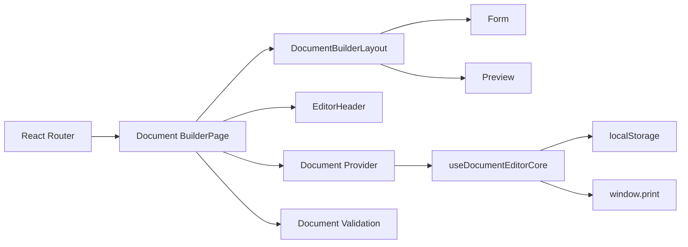

# DocKit - 국문 제출 문서 작성 도구

> 이력서, 자기소개서, 경력기술서를 입력하면서 A4 제출용 문서 형태로 미리 보고 PDF로 저장할 수 있는 React 문서 작성 도구입니다.

[데모 보기](https://dockit.jsjweb0.workers.dev/) · [GitHub](https://github.com/jsjweb0/dockit)

DocKit 예시 불러오기와 PDF 저장 흐름


## 🚀 왜 만들었나요?

한글·Word 기반 문서 작성은 복잡한 표 레이아웃을 셀 단위로 직접 수정해야 하는 번거로움이 있습니다.

직접 문서를 여러 번 작성/제출하며 겪었던 이 문제를, 실시간 미리보기 기반 웹 도구로 해결해보고자
1인으로 기획부터 배포까지 진행했습니다.

- 기획 → 이력서 표 양식 조사 → 데이터 모델 설계 → 실시간 미리보기 → 저장·검증 구현 → 문서별 편집기 구조 분리 → PDF 출력 순으로 진행
- 현재 이력서/자기소개서/경력기술서 3종 지원, 프로젝트 보고서/회의록 추가 예정

**개발 기간**: 2026.04 ~ 2026.08 (1인 개발)

---

## 핵심 구현 포인트

| 문제                                                          | 구현                                                       | 결과                                                                                             |
| ------------------------------------------------------------- | ---------------------------------------------------------- | ------------------------------------------------------------------------------------------------ |
| 국문 이력서의 복잡한 표 구조                                  | colSpan/rowSpan 기반 미리보기 컴포넌트와 print CSS 분리    | 화면용 preview와 인쇄용 스타일을 분리해 PDF 저장 시 표 경계, 여백, 숨김 UI를 print CSS에서 제어  |
| 새 문서 화면을 추가하려면 저장·검증·PDF까지 먼저 구현해야 했음 | 중앙 editor config를 제거하고 각 BuilderPage가 편집 흐름을 조립 | 기본 상태, Form, Preview, Page와 Router 등록만으로 새 문서 화면 구현 가능                        |
| 문서마다 저장·자동 저장·PDF 상태 관리가 반복됨                 | `useDocumentEditorCore`와 `createDocumentStorage`로 실제 반복 흐름만 공통화 | 문서별 저장 형식과 검증 정책은 독립적으로 유지하면서 60초 자동 저장과 dirty 상태 관리를 재사용 |
| 제출용 PDF 출력                                               | canvas 캡처 대신 window.print + @media print 사용          | 텍스트 선택 가능한 PDF 출력과 인쇄 레이아웃 관리                                                 |
| 이력서 검증 오류 위치 탐색이 복잡함                           | `resumeValidationAdapter`에서 fieldKey, tab, input id 매핑 | 전체 검증, 탭 오류 개수, 첫 오류 필드 포커스 이동을 하나의 흐름으로 처리                         |

---

## 설계 과정

DocKit은 국문 이력서, 자기소개서, 경력기술서처럼 문서 종류가 늘어나는 상황을 고려해 설계했습니다.  
처음에는 이력서 작성 기능에서 시작했지만, 문서가 추가되면서 저장, 검증, 미리보기, PDF 출력처럼 반복되는 흐름을 공통화할 필요가 있었습니다.


```mermaid
flowchart LR
  Router["React Router"] --> Page["Document BuilderPage"]
  Page --> Provider["Document Provider"]
  Page --> Header["EditorHeader"]
  Page --> Layout["DocumentBuilderLayout"]
  Page --> Validation["Document Validation"]
  Layout --> Form["Form"]
  Layout --> Preview["Preview"]
  Provider --> Core["useDocumentEditorCore"]
  Core --> Storage["localStorage"]
  Core --> Print["window.print"]
```

### 문서 종류가 자신의 편집 흐름을 소유하는 구조

각 BuilderPage가 문서별 Provider, 검증 hook, Header action, Form, Preview를 직접 조립합니다. 공통 영역에는 `EditorHeader`, `DocumentBuilderLayout`, `useDocumentEditorCore`, `createDocumentStorage`처럼 세 문서에서 실제로 반복되는 기능만 남겼습니다.

이 구조에서는 기본 상태와 Form, Preview로 편집 화면을 먼저 만든 뒤, 필요한 시점에 해당 문서 feature 내부에서 저장과 검증을 연결할 수 있습니다. 구조를 변경한 이유와 구현 범위는 아래 문제 해결 과정에서 설명합니다.

---

## 문제 해결

### 1. 화면 구현과 저장·검증 연결 순서를 분리한 편집기 구조

**문제**  
초기에는 문서별 Provider, editor hook, 검증 오류 개수, 샘플 데이터, PDF 함수, 최근 문서 저장소를 중앙 `editor.config`에서 관리했습니다.

하지만 새 문서 종류를 추가할 때 Form과 Preview만으로 화면을 확인할 수 없었고, 저장·검증·PDF 기능까지 중앙 config 계약에 맞춰 먼저 구현해야 했습니다.

Router가 이미 `/resume`, `/cover-letter`, `/career-summary`와 각 페이지를 연결하고 있는데도 공통 Layout이 pathname을 다시 판별했습니다. 이 과정에서 문서 타입을 `unknown`으로 변환한 뒤 다시 단언하는 타입 우회도 필요했습니다.

**해결**  
중앙 `editor.config`, `EditorLayout`, `EditorShell`을 제거했습니다.

각 문서의 BuilderPage가 다음 항목을 직접 조립하도록 변경했습니다.

- route parameter와 문서 ID
- 문서별 Provider
- editor와 validation hook
- Header action과 저장 상태
- Form과 Preview
- 전체 검증 오류 요약

공통화는 실제로 반복되는 기능에만 적용했습니다.

- `EditorHeader`: 저장, 초기화, 샘플, PDF, 미리보기 action
- `DocumentBuilderLayout`: Form과 Preview 반응형 배치
- `useDocumentEditorCore`: dirty 상태, 수동 저장, 60초 자동 저장, 초기화, PDF 상태
- `createDocumentStorage`: localStorage 저장과 최근 문서 요약 관리

Header의 저장·초기화·샘플·PDF action은 선택적으로 전달할 수 있게 해, 아직 저장 기능이 없는 문서도 공통 화면을 사용할 수 있도록 했습니다.

**결과**

저장·검증 없는 새 문서 화면은 문서 타입과 기본 상태, Form, Preview, BuilderPage, Router 등록만으로 구현할 수 있게 되었습니다.

기존에는 Router 외에도 중앙 config와 Provider, 저장, 검증, PDF 구현이 필수였지만, 리팩터링 후 편집 화면을 표시하기 위한 중앙 수정 지점은 Router 한 곳으로 줄었습니다. 홈 화면의 문서 카드와 최근 문서 목록까지 지원할 때는 각각 `documentTemplates.ts`와 `document.recent.ts`에 문서 정보를 추가합니다.

문서별 조립 코드가 일부 반복되지만 각 문서의 저장·검증 정책이 코드에 명시적으로 드러나며, 현재 규모에서는 별도의 범용 factory를 만드는 것보다 이해하기 쉬운 구조를 선택했습니다.

### 2. 문서별 복잡도에 맞는 검증 구조 설계

**문제**

이력서는 기본 정보, 학력, 경력, 프로젝트, 링크처럼 입력 항목과 반복 섹션이 많아 필드 단위 검증, 전체 검증, 첫 오류 필드 탐색이 복잡했습니다.
반면 자기소개서와 경력기술서는 검증 범위가 상대적으로 단순해 같은 adapter 구조를 모두 적용하면 오히려 코드가 무거워질 수 있었습니다.

**해결**

`useDocumentValidation`은 문서별 검증 규칙을 직접 알지 않고, adapter를 통해 필드 검증, 전체 검증, 오류 저장 방식을 주입받도록 구성했습니다.
이를 통해 errors, touchedFields, 필드 단위 재검증, 제출 전 전체 검증처럼 반복되는 상태 관리 흐름은 공통화하고, 실제 검증 규칙과 오류 구조는 각 문서의 validation 로직에 남겨, 문서별 복잡도에 맞게 관리했습니다.

**결과**

복잡한 이력서 검증은 재사용 가능한 구조로 정리하면서도, 단순한 문서에는 같은 adapter 구조를 강제하지 않았습니다. 문서마다 필요한 검증 수준을 선택할 수 있고, 검증 규칙은 각 문서 feature에서 확인할 수 있습니다.

### 3. 문서 데이터 교체와 검증 상태의 생명주기 연결

**문제**

PDF 출력 전 전체 검증으로 오류가 표시된 상태에서 예시 데이터를 불러오면 문서 값만 교체되고 오류 개수, 메시지, touched 상태가 남았습니다. 새 데이터와 이전 데이터의 검증 결과가 한 화면에 함께 표시되는 문제였습니다.

**해결**

초기화와 예시 불러오기에서 문서 데이터와 함께 `resetVersion`을 갱신하고, 문서별 validation hook이 이 값의 변경을 감지해 errors와 touched 상태를 초기화하도록 연결했습니다.

**결과**

문서 값이 교체될 때 이전 오류 개수, 메시지, touched 상태가 함께 초기화됩니다. PDF 검증 후 예시 불러오기 흐름을 BuilderPage 테스트에 추가해 세 문서에서 오류 요약이 0으로 바뀌는 동작을 확인했습니다.

---

## 기술 선택과 구현 근거

| 선택 | 적용 범위와 근거 |
| --- | --- |
| React 19 + TypeScript | 문서 데이터를 타입으로 정의하고 Form과 Preview가 같은 상태를 사용하도록 구성했습니다. 반복 섹션과 문서별 컴포넌트 사이의 데이터 계약을 타입 검사로 확인합니다. |
| Context API | 편집 상태가 각 문서의 Provider 하위에서만 필요하므로 별도의 전역 상태 라이브러리를 사용하지 않았습니다. Form, Preview, Header action이 같은 문서 상태를 사용합니다. |
| 순수 함수 기반 validation | 탭별 오류 개수, 첫 오류 필드, 반복 항목 id를 문서별 오류 구조에 맞게 계산하고 UI와 분리해 단위 테스트합니다. |
| localStorage | `createDocumentStorage`에서 문서 저장·복원과 최근 문서 요약 갱신을 처리합니다. 저장 데이터에는 `meta.version`을 포함합니다. |
| `window.print` + print CSS | 문서를 canvas 이미지로 변환하지 않고 브라우저 인쇄 기능으로 출력합니다. A4 여백, 표 경계, 인쇄 시 숨길 UI는 print CSS에서 제어합니다. |
| Radix UI + Tailwind CSS | AlertDialog, Tabs, Tooltip의 키보드 동작을 사용하고, 모바일 Form·Preview 전환과 데스크톱 분할 배치를 반응형 클래스로 구현했습니다. |
| Vite + Cloudflare Workers Assets | Vite의 `dist` 결과물을 Workers Assets로 배포하며, `wrangler.jsonc`에서 React Router SPA의 직접 URL 접근과 새로고침을 처리합니다. |

---

## 반응형과 접근성

- 모바일에서는 입력 폼과 미리보기를 전환하며 작성할 수 있도록 구성했습니다.
- 데스크톱에서는 입력 영역과 미리보기 영역을 함께 확인할 수 있도록 배치했습니다.
- 입력 필드는 label로 접근 가능하게 만들고, 오류 상태는 `aria-invalid`, 오류 설명은 `aria-describedby`로 연결했습니다.
- 탭 전환 시 첫 오류 필드 포커스, AlertDialog 닫힘 후 포커스 복귀, `prefers-reduced-motion` 대응을 적용했습니다.

---

## 테스트

현재 15개 테스트 파일에서 95개 테스트를 실행하고 있습니다. 순수 함수 단위 테스트(Vitest)와 사용자 흐름 테스트(React Testing Library)를 나누어 검증했습니다.

- validation 단위 테스트: 연락처, 이메일, URL 형식, 반복 섹션 필수값, 날짜 역전, 첫 오류 필드와 탭별 오류 개수
- 문서 편집 core 테스트: 수동 저장, 60초 자동 저장, debounce 재시작, 수동 저장 후 예약 취소, 저장 실패 시 dirty 상태 유지
- BuilderPage 통합 테스트: 신규 문서 URL redirect, Form과 Preview의 상태 공유, 샘플·저장 연결, 문서별 저장 전 검증
- PDF 및 검증 상태 테스트: 인쇄 title과 `body.printing` 복원, PDF 검증 오류 후 sample 적용 시 오류 초기화
- 최근 문서 테스트: 문서 종류 병합, 최신순 정렬, 링크 생성, 삭제 함수 연결

```bash
npm run test:run
```

### AI 에이전트 활용

Codex 서브 에이전트로 편집기 구조, 기존 기능에 미칠 영향, 테스트 누락을 나누어 검토했습니다. 코드 충돌을 줄이기 위해 구현은 한 에이전트로 제한하고, 리뷰 결과는 실제 코드와 자동화 테스트로 다시 확인했습니다.

직접 화면을 테스트하며 PDF 검증 후 예시 불러오기에서 이전 오류가 남는 문제를 발견했고, 수정 후 같은 문제가 다시 발생하지 않도록 테스트를 추가했습니다.

---

## 폴더 구조

```text
src/
├── components/
│   └── layout/              # EditorHeader와 반응형 문서 action UI
├── features/
│   ├── documents/           # 저장 core, PDF 출력, 최근 문서, 공통 Builder UI
│   ├── resume/              # 이력서 Context, 타입, 검증, Form, Preview
│   ├── coverLetter/         # 자기소개서 Context, 타입, 검증, Form, Preview
│   └── careerSummary/       # 경력기술서 Context, 타입, 검증, Form, Preview
├── layout/
│   ├── DefaultLayout.tsx    # 홈 화면 공통 레이아웃
│   └── documentTemplates.ts # 홈 문서 카탈로그 정보
├── pages/                   # 문서별 Provider와 편집 UI를 조립하는 route page
├── router.tsx               # 문서 URL과 BuilderPage 연결
└── utils/                   # 날짜, 문자열 등 공통 유틸
```

---

## 설치 및 실행

```bash
npm install
npm run dev
```

개발 서버 실행 후 `http://localhost:5173`에서 확인할 수 있습니다.

```bash
npm run lint
npm run build
npm run test:run
```

---

## 배포

Vite 빌드 결과물인 `dist` 폴더를 Cloudflare Workers Assets로 배포합니다. React Router를 사용하는 SPA라서 `wrangler.jsonc`에서 직접 URL 접근과 새로고침을 처리하도록 설정했습니다.

```bash
npm run deploy
```

---

## 앞으로 개선할 점

- 실제 Chrome 인쇄 미리보기에서 A4 페이지 분할과 브라우저별 출력 차이 점검
- 모바일에서 문서 종류별 작성·미리보기·저장 E2E 테스트 추가
- localStorage의 이전 문서 버전을 변환하는 migration 전략 보강
- 저장 실패와 localStorage 용량 초과 상황의 사용자 안내 개선
- 복잡한 반복 폼이 늘어날 경우 React Hook Form과 Zod를 도입해 폼 상태·검증 schema 관리 단순화
- 회의록 신규 양식을 화면부터 구현한 뒤 저장·검증 기능 단계적 연결
