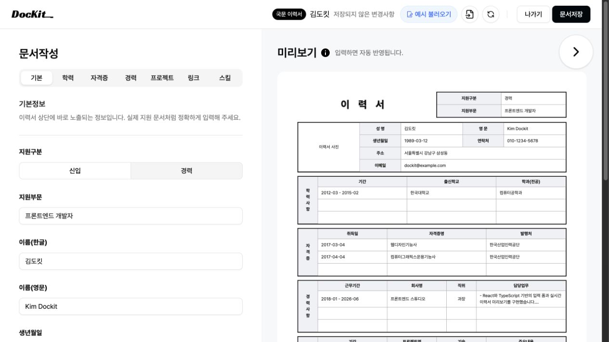
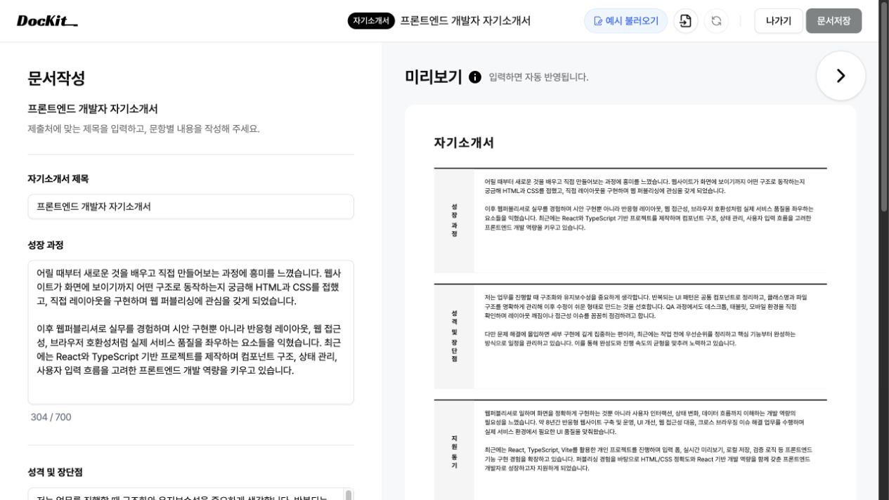
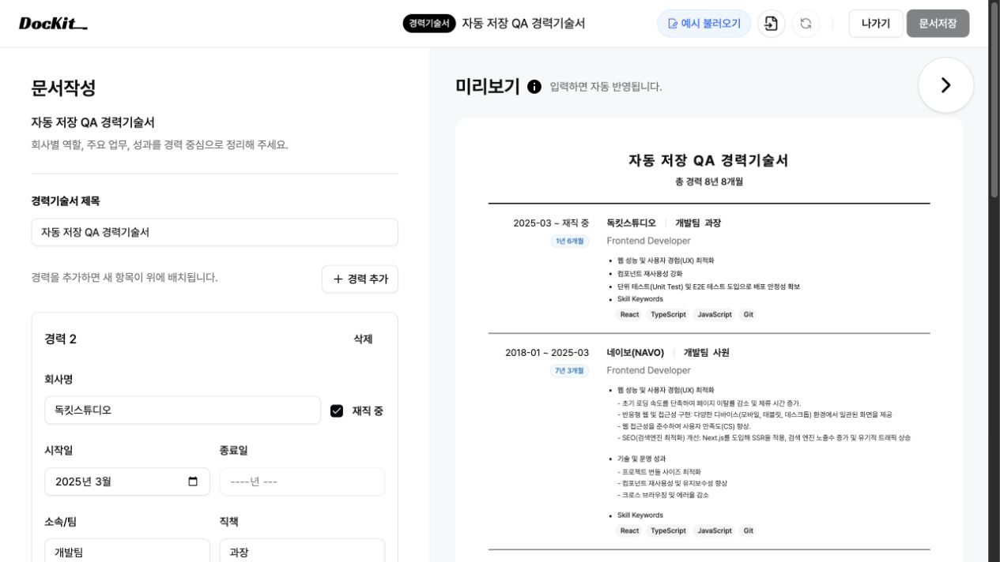
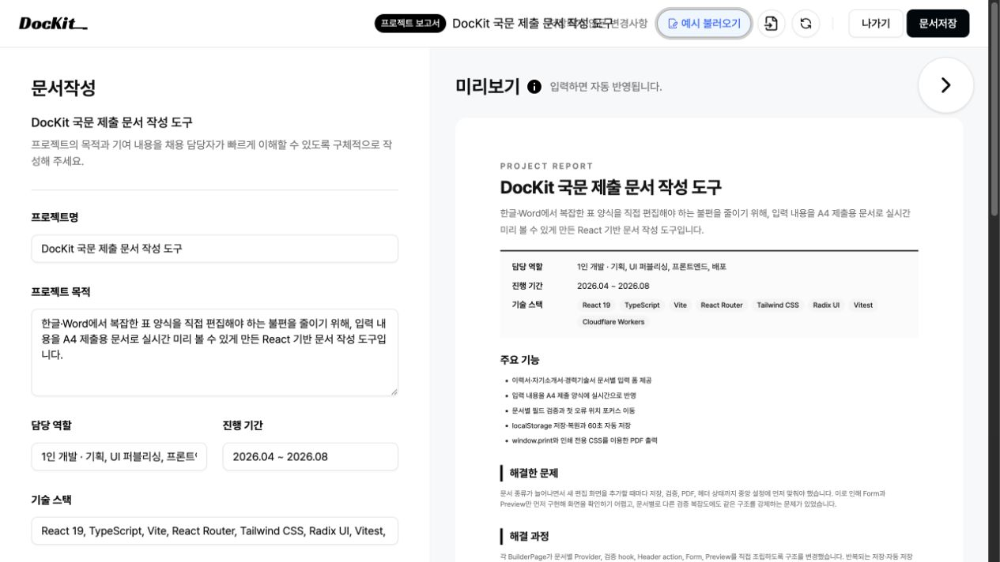
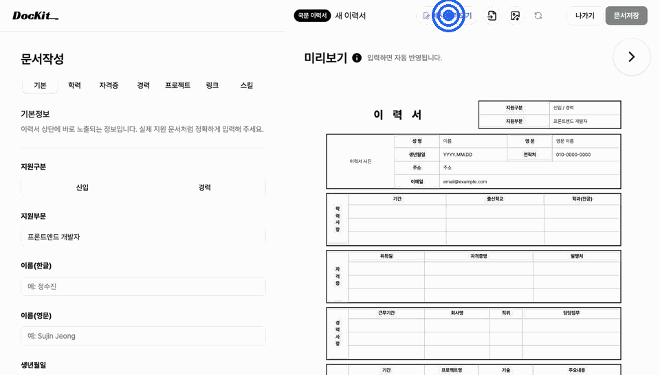
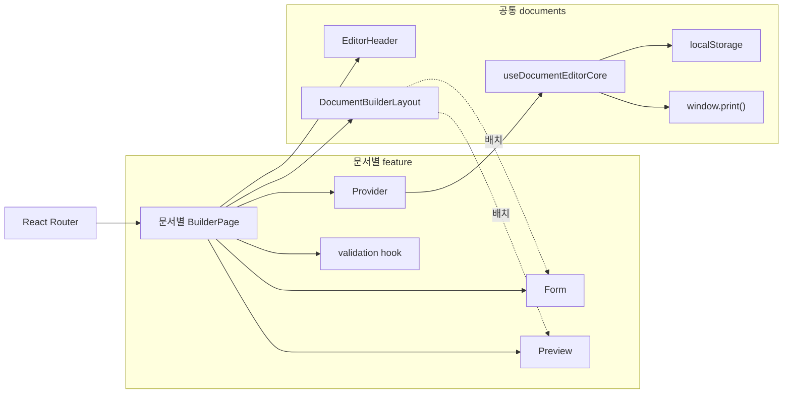

# DocKit - 국문 제출 문서 작성 도구

> 이력서·자기소개서·경력기술서·프로젝트 보고서를 작성하면서 A4 제출 형태를 실시간으로 확인하고, 저장과 PDF 출력까지 이어갈 수 있는 React 문서 작성 도구입니다.

[데모 보기](https://dockit.jsjweb0.workers.dev/) · [GitHub](https://github.com/jsjweb0/dockit)

**React 19 · TypeScript · Vite · Tailwind CSS · Radix UI · Vitest · Cloudflare Workers**

## 프로젝트 핵심

DocKit은 단순한 입력 폼이 아니라 복잡한 문서 데이터를 Form과 Preview에서 공유하고, 저장·검증·출력까지 하나의 편집 흐름으로 연결한 React 프로젝트입니다.

`문서 선택 → 작성 → 실시간 Preview → 검증 → 저장 → PDF 출력`

- 이력서·자기소개서·경력기술서·프로젝트 보고서 4종 지원
- 수동 저장, 60초 자동 저장, 최근 문서 관리
- 필수값·형식 검증과 첫 오류 필드 자동 이동
- 브라우저 인쇄와 print CSS 기반 PDF 출력
- 모바일 패널 전환·데스크톱 분할 화면 반응형 구성
- 22개 테스트 파일, 136개 테스트 통과
- Cloudflare Workers 배포

## 결과 화면

Form과 Preview가 하나의 문서 상태를 공유해 입력 결과를 바로 확인할 수 있습니다.

| 국문 이력서                                                                   | 자기소개서                                                                         |
| ----------------------------------------------------------------------------- | ---------------------------------------------------------------------------------- |
|         |         |
| **경력기술서**                                                                | **프로젝트 보고서**                                                                |
|  |  |

<details>
<summary>예시 불러오기와 PDF 저장 흐름 보기</summary>



</details>

## 왜 만들었나요?

한글·Word 기반 제출 문서는 복잡한 표 양식을 셀 단위로 수정해야 하고, 내용을 바꿀 때마다 실제 출력 형태를 다시 확인해야 하는 불편이 있습니다.

DocKit은 입력 폼과 제출용 미리보기를 한 화면에 연결해 이 과정을 줄입니다. 국내 구직 과정에서 자주 사용하는 문서 4종을 같은 사용 흐름으로 제공하면서도, 각 문서의 데이터·검증·저장 정책은 독립적으로 관리하도록 설계했습니다.

- 입력과 동시에 A4 제출 형태 확인
- 문서별 필수값 검증과 첫 오류 위치 안내
- 수동 저장, 60초 자동 저장, 최근 문서 관리
- 텍스트 선택이 가능한 브라우저 인쇄 기반 PDF 출력
- 모바일 작성·미리보기 전환과 데스크톱 분할 화면

**개발 기간**: 2026.04 ~ 2026.08 · **담당**: 기획, UI 구현, 데이터 모델, 검증, 테스트, 배포를 포함한 1인 개발

---

## 핵심 구현 결과

| 해결할 문제                                              | 구현 방식                                                            | 확인된 결과                                                                           |
| -------------------------------------------------------- | -------------------------------------------------------------------- | ------------------------------------------------------------------------------------- |
| 국문 이력서의 복잡한 표 구조                             | `colSpan`/`rowSpan` 기반 Preview와 print CSS 분리                    | 같은 문서 상태로 화면 미리보기와 A4 인쇄 레이아웃을 각각 제어                         |
| 새 문서를 추가할 때 저장·검증·PDF까지 먼저 필요했던 구조 | 각 BuilderPage가 필요한 편집 기능을 직접 조립하도록 중앙 설정 제거    | 프로젝트 보고서를 기본 상태 → Form/Preview → 저장·검증 순서로 단계적으로 연결         |
| 문서마다 반복되는 저장 상태 관리                         | 중복 저장·자동 저장 흐름을 공통 hook과 storage 계층으로 분리          | 문서별 데이터 형식은 유지하면서 dirty 상태와 60초 자동 저장을 재사용                  |
| 입력 오류 위치를 찾기 어려운 긴 문서                     | 문서별 validation과 첫 오류 필드 탐색을 UI 상태와 분리               | 전체 오류 개수 표시, 입력 중 재검증, 첫 오류 필드 포커스 이동을 자동화                |
| 제출 문서의 PDF 출력                                     | canvas 캡처 대신 `window.print()`와 `@media print` 사용              | 이미지로 변환하지 않고 텍스트를 선택할 수 있는 출력 흐름 구현                              |

---

## 설계 구조

문서별 feature가 데이터, Form, Preview, Provider, validation을 소유하고 공통 계층은 편집 화면 배치와 저장·출력 흐름만 담당합니다. 따라서 화면부터 만든 뒤 저장과 검증을 단계적으로 연결할 수 있습니다.


```mermaid
flowchart LR
  Router["React Router"] --> Page["문서별 BuilderPage"]

  subgraph Feature["문서별 feature"]
    Page --> Provider["Provider"]
    Page --> Validation["validation hook"]
    Page --> Form["Form"]
    Page --> Preview["Preview"]
  end

  subgraph Shared["공통 documents"]
    Page --> Header["EditorHeader"]
    Page --> Layout["DocumentBuilderLayout"]
    Provider --> Core["useDocumentEditorCore"]
    Core --> Storage["localStorage"]
    Core --> Print["window.print()"]
  end

  Layout -. 배치 .-> Form
  Layout -. 배치 .-> Preview
```

---

## 문제 해결

### 1. 초기 과도한 추상을 걷어내고 단계적 구현 구조로 변경

처음에는 편집 기능을 중앙 설정으로 통합했지만, 실제 문서를 추가하면서 오히려 확장을 막는다는 사실을 발견했습니다. 중앙 설정을 제거하고 각 BuilderPage가 필요한 기능을 조립하게 바꿨습니다. 그 결과 프로젝트 보고서를 화면부터 구현한 뒤 저장과 검증을 순서대로 연결할 수 있었습니다.

<details>
<summary>구조 변경 과정 자세히 보기</summary>

**Before**

```text
중앙 editor.config
└── Provider + 저장 + 검증 + 예시 + PDF 구현이 모두 있어야 화면 등록 가능
```

Router에서 이미 문서 페이지를 선택했지만 공통 Layout이 pathname으로 문서 종류를 다시 판별했고, 서로 다른 문서 타입을 `unknown`으로 바꾼 뒤 단언하는 우회도 필요했습니다.

**After**

```text
문서별 BuilderPage
├── feature 소유: Provider, validation, Form, Preview
└── 공통 재사용: Header, Layout, editor core, storage
```

Header action을 선택적으로 전달할 수 있게 하여 기본 상태와 Form, Preview만으로 편집 화면을 먼저 만들 수 있습니다. 저장·검증은 문서 feature 내부에서 나중에 연결합니다.

문서별 조립 코드가 일부 반복되는 대신 각 문서의 정책과 의존성이 코드에 명시적으로 드러납니다. 현재 4종 규모에서는 범용 factory보다 이 구조가 읽고 수정하기 쉽다고 판단했습니다.

</details>

### 2. 문서별 오류 구조에 맞는 검증 설계

이력서는 여러 탭과 반복 항목 때문에 필드 key, 탭, input id를 함께 찾아야 합니다. 자기소개서·경력기술서·프로젝트 보고서도 필수값과 형식 검증이 있지만 오류 탐색 범위와 데이터 구조가 서로 다릅니다. 공통 상태 흐름을 재사용하되 실제 규칙은 각 feature에 남겼습니다.

<details>
<summary>검증 구조 자세히 보기</summary>

- 이력서: `useDocumentValidation`과 `resumeValidationAdapter`로 탭별 오류 개수와 첫 오류 위치를 계산합니다.
- 자기소개서·경력기술서·프로젝트 보고서: 문서별 validation 함수와 hook에서 오류 구조를 직접 관리합니다.
- 경력기술서: 필수값뿐 아니라 `YYYY-MM` 형식, 시작일·종료일 역전, 재직 중 상태 등을 검증합니다.
- 공통 사용자 흐름: 전체 검증, 오류 개수 표시, 오류 필드 입력 중 재검증, 첫 오류 필드 포커스 이동을 제공합니다.

모든 문서에 같은 adapter를 강제하지 않아 단순성을 유지하면서도, 검증 규칙은 UI 컴포넌트와 분리해 테스트할 수 있습니다.

</details>

### 3. 문서 교체와 검증 상태의 생명주기 연결

오류가 표시된 뒤 예시 데이터를 불러오면 이전 오류와 새 문서가 함께 보이는 문제가 있었습니다. 데이터 교체 시 `resetVersion`을 갱신하고 validation hook이 errors와 touched 상태를 함께 초기화하도록 연결했습니다. 이 흐름은 BuilderPage 테스트로 회귀를 방지합니다.

<details>
<summary>오류가 남았던 이유와 수정 내용 보기</summary>

문서 값과 검증 상태는 서로 다른 hook이 관리하므로 값만 교체하면 오류 개수, 메시지, touched 상태는 그대로 남습니다. 초기화와 예시 불러오기를 문서 교체 이벤트로 정의하고, 각 validation hook이 같은 이벤트에 반응하도록 생명주기를 맞췄습니다.

PDF 실행 전 전체 검증 → 오류 표시 → 예시 적용 흐름에서 오류 요약이 0으로 돌아오는지 문서별 테스트로 확인합니다.

</details>

---

## 기술 선택과 트레이드오프

| 선택                             | 적용 범위와 판단                                                                                                                                                                                                                                              |
| -------------------------------- | ------------------------------------------------------------------------------------------------------------------------------------------------------------------------------------------------------------------------------------------------------------- |
| React 19 + TypeScript            | Form과 Preview가 공유하는 문서 데이터 계약을 타입으로 고정하고 반복 항목을 컴포넌트로 분리했습니다.                                                                                                                                                           |
| Context API                      | 문서 상태의 사용 범위가 각 BuilderPage 내부라 별도 전역 상태 라이브러리를 추가하지 않았습니다. 독립 Provider는 경계를 명확하게 하지만 문서 종류가 크게 늘어 조립 코드의 반복이 유지보수 비용으로 이어지면 factory나 공통 form 계층을 다시 검토할 계획입니다. |
| 순수 함수 기반 validation        | 날짜 형식·날짜 역전·필수값·URL 같은 규칙을 UI와 분리해 단위 테스트합니다. 오류 상태의 모양은 문서 복잡도에 맞게 유지합니다.                                                                                                                                   |
| localStorage                     | `createDocumentStorage`에서 저장·복원과 최근 문서 갱신을 처리합니다. 저장 형식을 식별할 수 있도록 데이터에 `meta.version`을 포함했습니다.                                                                                                                        |
| `window.print()` + print CSS     | canvas 이미지보다 텍스트 선택과 브라우저 기본 인쇄 기능을 우선했습니다. 인쇄 전후 `document.title`과 `body.printing` 상태를 적용·복원하는 흐름은 테스트로 확인합니다.                                                                                                  |
| Radix UI + Tailwind CSS          | Dialog·Tabs·Tooltip의 키보드 동작을 활용하고, 모바일 전환과 데스크톱 분할 화면을 반응형 클래스로 구성했습니다.                                                                                                                                                |
| Vite + Cloudflare Workers Assets | Vite의 정적 빌드 결과물을 배포하고 SPA 직접 URL 접근과 새로고침을 `wrangler.jsonc`에서 처리합니다.                                                                                                                                                            |

---

## 반응형과 접근성

- 모바일에서는 Form과 Preview를 전환하고, 데스크톱에서는 두 영역을 함께 확인합니다.
- 입력 필드는 `label`과 연결하고 오류 상태는 `aria-invalid`, 오류 설명은 `aria-describedby`로 제공합니다.
- 탭 이동 후 첫 오류 필드 포커스, Dialog 종료 후 포커스 복귀, `prefers-reduced-motion`을 적용했습니다.
- 제출 문서는 시맨틱 heading, table, list 구조를 사용해 내용 계층을 유지합니다.

---

## 테스트

현재 **22개 테스트 파일, 136개 테스트**로 순수 함수와 사용자 흐름을 나누어 확인합니다. 커버리지 비율은 아직 측정하지 않아 테스트 개수와 범위만 명시합니다.

- validation: 필수값, 연락처·이메일·URL, `YYYY-MM`, 날짜 역전, 반복 항목, 첫 오류 위치
- 편집 core: 수동 저장, 60초 자동 저장, 예약 취소, 저장 실패 시 dirty 상태 유지
- BuilderPage: Form/Preview 상태 공유, 예시·저장 연결, 저장·PDF 전 검증, 초기화
- PDF/검증 상태: 인쇄 title과 `body.printing` 복원, 데이터 교체 시 이전 오류 초기화
- 최근 문서: 문서 종류 병합, 최신순 정렬, 링크 생성, 삭제 연결

```bash
npm run test:run
```

---

## 폴더 구조

```text
src/
├── components/
│   └── layout/                 # EditorHeader와 문서 action UI
├── features/
│   ├── documents/              # 저장 core, PDF, 최근 문서, 공통 Builder UI
│   ├── resume/                 # 이력서 타입, Context, 검증, Form, Preview
│   ├── coverLetter/            # 자기소개서 타입, Context, 검증, Form, Preview
│   ├── careerSummary/          # 경력기술서 타입, Context, 검증, Form, Preview
│   └── projectReport/          # 프로젝트 보고서 타입, Context, 검증, Form, Preview
├── layout/
│   ├── DefaultLayout.tsx       # 홈 화면 공통 레이아웃
│   └── documentTemplates.ts    # 홈 문서 카탈로그
├── pages/                      # 문서별 편집 흐름을 조립하는 route page
├── router.tsx                  # 문서 URL과 BuilderPage 연결
└── utils/                      # 날짜, 문자열 등 공통 유틸
```

---

## 설치 및 실행

```bash
npm install
npm run dev
```

개발 서버 실행 후 `http://localhost:5173`에서 확인할 수 있습니다.

```bash
npm run typecheck
npm run lint
npm run test:run
npm run build
```

---

## 배포

Vite 빌드 결과물인 `dist`를 Cloudflare Workers Assets로 배포합니다. React Router SPA의 직접 URL 접근과 새로고침은 `wrangler.jsonc`에서 처리합니다.

```bash
npm run deploy
```

---

## 앞으로 개선할 점

- 반복 필드가 많은 신규 양식이 추가될 경우 React Hook Form과 Zod를 검토해 폼 상태 관리와 검증 스키마의 중복 줄이기
